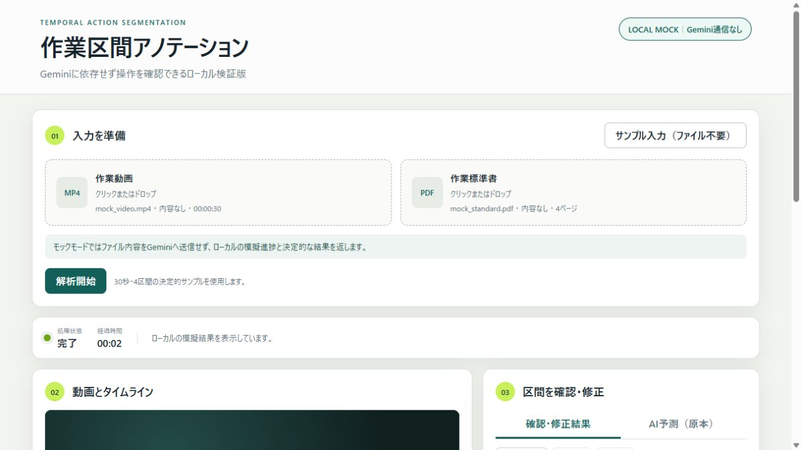
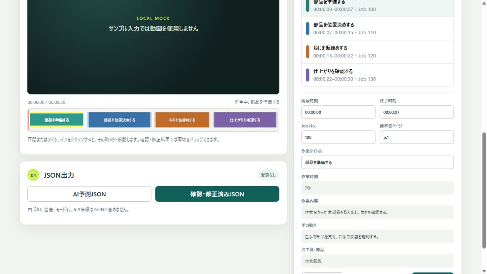

# 作業区間アノテーション — Gemini TAS ローカル検証モック

作業動画の「いつ、何をしているか」を区間ごとに確認・修正する画面を、手元のPCで試すためのデモです。

現在の版は **ローカルモック** です。「サンプル入力」を選べば、MP4やPDFを用意せずに操作できます。既定設定ではGeminiや外部サービスへ通信しません。

> [!IMPORTANT]
> 画面と編集機能を確認するためのMVPです。実際の動画・PDFをGeminiで解析する機能は、まだ実装・検証していません。

## 画面イメージ



サンプル入力を使うと、ファイルを選ばずにローカル模擬解析を実行できます。画面右上の `LOCAL MOCK｜Gemini通信なし` が、外部通信をしないモードの目印です。



色分けされたタイムラインと区間一覧を見ながら、時刻、Job No.、標準書ページ、作業タイトルを修正できます。

## このデモでできること

- ファイル不要のサンプル入力で、30秒・4区間の模擬結果を表示する
- ローカルの模擬進捗を確認する
- 動画表示、タイムライン、区間一覧を確認する
- 開始・終了時刻、Job No.、標準書ページ、作業タイトルを編集する
- 区間を追加・削除し、Undo・Redoで操作を戻す／やり直す
- 元の予測結果と、人が確認・修正した結果を別々のJSONとして出力する
- 実行中の画面待機を中止し、その後もう一度実行する

## まず試す方法（約3分）

### 1. 必要なもの

- Windows、macOS、またはLinuxのPC
- Node.js 20以上

追加ライブラリのインストールや、GeminiのAPIキーは不要です。

### 2. 起動する

このフォルダーでPowerShellまたはターミナルを開き、次を実行します。

```powershell
npm start
```

PowerShellで「スクリプトの実行が無効」と表示された場合は、次のどちらかを使います。

```powershell
npm.cmd start
# または
node server.js
```

### 3. 画面を開く

ブラウザで次のURLを開きます。

<http://127.0.0.1:4173/>

### 4. サンプルを動かす

1. 「サンプル入力（ファイル不要）」を押す
2. 「解析開始」を押す
3. 確認メッセージで続行する
4. 数秒後に表示されるタイムラインと4つの区間を確認する
5. 区間を選び、時刻やタイトルを編集して「変更を確定」を押す

終了するときは、起動したPowerShellまたはターミナルで `Ctrl + C` を押します。

## 画面の見方

| 番号 | 場所 | できること |
|---|---|---|
| 01 | 入力を準備 | サンプル入力を選び、模擬解析を始めます |
| 02 | 動画とタイムライン | 作業区間の位置と長さを色分けして確認します |
| 03 | 区間を確認・修正 | 区間の時刻や作業情報を編集します |
| 04 | JSON出力 | 元の予測と、確認・修正済み結果を分けて出力します |

## 2種類の出力について

- **AI予測JSON**：解析直後の元データです。画面で修正しても書き換わりません。
- **確認・修正済みJSON**：人が画面で確認・修正した後のデータです。

この分離により、「AIが最初に出した内容」と「人が確認した最終内容」を混同せずに扱えます。

## 安全性とデータの扱い

- 起動時の既定は `MOCK_MODE=true` です
- モックではGemini APIへ通信しません
- サーバーは同じPCからだけアクセスできる `127.0.0.1` で待ち受けます
- APIキーをブラウザへ渡しません
- Geminiの生の応答を画面、ログ、ファイルへ出しません
- interaction IDの保存・表示・ログ出力は行いません
- 実行中の「中止」は画面上の待機をやめる操作です。実API利用時にGemini側の処理停止を保証するものではありません

## 現在の制約

- 実際のMP4やPDFをGeminiへ送って解析する機能はありません
- Gemini Proモデルは実行できません
- 複数案件の保存・検索・共有を行う業務システムではありません
- サンプル入力の結果は、毎回同じ内容を返す動作確認用データです

そのため、現段階では実データや機密資料を用意しなくても、UIと操作の確認を進められます。実動画・実PDFを使う評価は、利用環境・データ管理・API利用許可を別途確認してから行う次の段階です。

## 開発者向け情報

テストは次のコマンドで実行できます。

```powershell
npm test
```

PowerShellの実行ポリシーで `npm` が拒否される場合は、`npm.cmd test` または `node --test` を使えます。

実API用コードはFlashモデルの同期テキスト通信だけを許可し、`store:false` を指定します。`background`、GET polling、Gemini cancel、interaction DELETEは使用しません。通常の画面確認では実APIモードを使用しないでください。

詳しい仕様と検証結果は次を参照してください。

- [仕様書](docs/SPEC.md)
- [設計書](docs/DESIGN.md)
- [実装・検証結果](docs/IMPLEMENTATION_RESULT.md)
