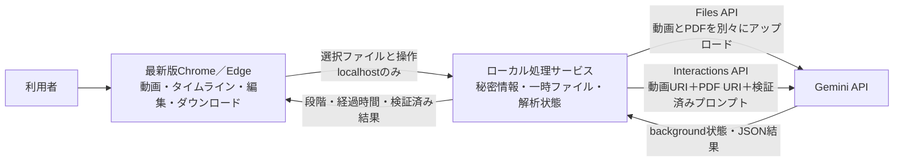

# 作業動画 × Gemini API アノテーション支援デモ 設計書

> 2026-09-07: 以下は旧MVPの設計履歴。現行設計は [Few-shot Round 18](2026-09-06_FEWSHOT_SPEC.md) と [運用・実装契約](FEWSHOT_OPERATIONS.md)。保存しない方針、Flash限定、旧9項目を直接モデル出力とする構成など、競合する旧記述は適用しない。

- 文書種別: MVP基本設計書
- 作成日: 2026-08-15
- 状態: Claudeレビュー・ユーザー判断反映済み（実装済み、最終レビュー指摘対応中）
- 正式要件: `docs/SPEC.md`（2026-08-14、Claudeレビュー反映済み）
- 対象フェーズ: 設計

## 1. 設計の目的と前提

本書は、MP4動画1本と作業標準書PDF1冊をGeminiで同時に解析し、AI予測を人が動画とタイムラインで確認・修正して、`prediction.json` と `reviewed.json` を別々に出力するMVPの設計方針を定める。

本書は確定済みの `docs/SPEC.md` を具体化する。検証済みプロンプト `reference/validated_prompt.md` と正式JSONの9項目は変更しない。Action Segmentation、複数ユーザー、案件管理、クラウド本番運用は設計対象外とする。

### 1.1 実装時の優先制約（2026-08-15）

実測により、Gemini Interactions APIではbackground interactionの作成は成功する一方、実行中の通常GET pollingとcancelが同じAuthorization keyでHTTP 403となり、完了後の同じGETはHTTP 200になる状態依存の不整合が確認された。REST直呼びとGoogle公式Python SDKの両方で再現している。詳細は `docs/IMPLEMENTATION_PRECHECK.md` を参照する。

このため、ローカル検証MVPでは本書3.5・3.6・5.2・5.3・8章・9章・13.2・14章・16章・17章・18章にあるbackground execution、5秒GET polling、Gemini cancel、interaction ID記録の記述より、次の実装制約を優先する。

- 既定を `MOCK_MODE=true` とし、Geminiへ通信せず決定的な正式9項目結果とローカル模擬進捗を返す。
- `MOCK_MODE=false` でも `background` を送信せず、`store=false` の同期リクエストだけを使う。
- 実API検証は無料枠の `gemini-3.5-flash` または `gemini-3.6-flash` に限定し、テキストだけを送る。動画・PDFは送信しない。
- `gemini-3.1-pro-preview` は本番想定の設定既定値として維持するが、課金設定とユーザー明示許可なしに実行しない。
- interaction IDの追跡、GET polling、Gemini cancel、DELETE、IDの一時保存を実装しない。
- 中止はブラウザの待機とローカルHTTPを中断し、後着結果を破棄する。Geminiクラウド側の処理停止は表示・保証しない。

正式JSON、原本/編集結果の分離、編集・ダウンロード要件、APIキー隔離、`127.0.0.1`限定、ローカル操作トークンなど、上記と矛盾しない設計は維持する。

今回の設計で前提とする利用形態は次のとおりである。

- 1人の利用者がWindows PCの最新版ChromeまたはEdgeで利用する。
- Web画面とローカル処理サービスは同じPCで動作する。
- 外部サービスとしてGemini APIだけを利用する。
- 入力は公開可能な非機密のデモ資料に限定する。
- 編集状態と結果は利用中のセッションだけで保持し、永続化しない。
- 実装着手前の小規模疎通には、ユーザー管理の私用Gemini APIキーを使用できる。動画・PDFを用いる代表データ検証は実装後に行う。

## 2. SPECとの対応関係

| SPECの主要要件 | 本書の対応箇所 | 設計上の扱い |
|---|---|---|
| 動画1本＋PDF1冊 | 7章、8章 | 1解析につき各1ファイルに固定 |
| 検証済みプロンプト | 8章 | ファイル内容をそのまま使用し、画面編集不可 |
| モデルを画面で選ばせない | 8章、14章 | 画面外の非秘密設定で切替 |
| 処理段階・経過時間 | 6章、9章 | 根拠のない進捗率を表示しない |
| 解析の中止・再実行 | 13章 | 中止は即時に画面へ反映し、外部停止は最善努力 |
| 正式JSONの9項目 | 10章 | 項目追加・削除・名称変更なし |
| A/BのJSON検証 | 10章 | A違反は全体エラー、B違反は警告付き編集 |
| 動画・タイムライン双方向連動 | 11章 | 共通の秒単位時刻を基準に同期 |
| 1秒単位編集 | 11章 | ドラッグは概略、数値入力で厳密確定 |
| AI予測と人手結果を分離 | 10章、12章 | 不変の予測原本と編集用コピーを分離 |
| セッション内保持、JSON出力 | 12章 | サーバー永続保存なし |
| APIキー非表示 | 14章 | ローカル処理サービスだけが参照 |
| 最新Chrome／Edge | 15章 | 受入試験時の最新版安定版を記録 |
| 非機密データのみ | 14章、16章 | 外部送信前に明示確認 |

### 2.1 SPEC 18の確認ゲートとの対応

SPEC 18章で、ユーザー判断を要する項目と、実装・受入時に行う確認作業を分離した。現在の対応を次に示す。

| SPEC 18の項目 | 現在の状態 | 実施時期 |
|---|---|---|
| APIキー認証・候補モデルの利用可否 | 公式一覧は確認済み。実プロジェクトでの疎通は未実施 | 実装着手前の小規模疎通 |
| `response_format` のJSON Schema受理 | 正式9項目の最小Schemaを設計済み。APIでの受理は未確認 | 実装着手前のテキストのみの小規模疎通 |
| 候補モデルごとの `max_output_tokens` 上限 | モデル別の公式上限確認は未実施 | 実装着手前の小規模疎通 |
| 動画＋PDF同時投入、2GB上限、アップロード、解析時間 | 公式文書で確認済み。実データでの確認は未実施 | 実装後、代表データ入手後 |
| 初期採用モデル | 3候補を同一入力で比較して確定する方針を決定済み | 実装後、代表データ入手後 |
| `response_format` の効果 | 既定で使用し、画面外で無効化可能と決定済み | 実装後、代表データ入手後に比較 |
| 対応ブラウザバージョン | 受入試験日のWindows版Chrome／Edge最新版安定版を記録する方針 | 受入試験時 |
| 代表動画の長さ・コーデック・容量、PDF構成 | データ未提供のため未確認 | 実装後、代表データ入手後 |

SPEC 9.1・11.1に残る「設計フェーズで検討／判断する」という表現については、本書8.3・3.3・11.3で設計判断済みである。SPEC本文の表現整理はユーザー承認後に行う。対応ブラウザ確認は受入試験時に行う方針とし、ユーザー承認によりSPEC 18.1から18.2へ移動した。

## 3. 設計開始前の実現性確認結果

確認日は2026-08-15である。確認にはGoogleの公式ドキュメントだけを使用し、APIキーや実データは使用していない。

### 3.1 候補モデル

候補の3モデルはいずれもGemini APIの公式モデル一覧に存在する。

| モデルID | 提供状態 | 動画・PDF入力 | 入力上限 | メリット | デメリット |
|---|---|---|---:|---|---|
| `gemini-3.1-pro-preview` | Preview | 対応 | 1,048,576 tokens | 既存の3.1 Pro系検証と比較しやすい | Previewの変更・終了リスク、比較的厳しいrate limit |
| `gemini-3.5-flash` | Stable | 対応 | 1,048,576 tokens | Stableで候補要件を満たす | 公式一覧では旧世代Flash扱い |
| `gemini-3.6-flash` | Stable | 対応 | 1,048,576 tokens | 新しいStableでマルチモーダル対応 | 過去検証との条件差が大きくなる |

利用者からは隠す初期モデルについては、実装後に3候補を同一の代表動画・PDFで比較し、精度、JSON形式合格率、処理時間、費用、提供安定性を基準に確定する。比較完了までの暫定候補は、`reference/gemini_validation_notes.md` にある3.1 Pro系検証との比較可能性を重視した `gemini-3.1-pro-preview` とする。Previewの変更・終了リスクと、検証メモの表記 `gemini-pro-3.1-preview` と現公式IDとの差異は、比較結果と実装着手前の小規模疎通で確認する。

モデルIDは画面に出さず、ローカル処理サービスの非秘密設定 `GEMINI_MODEL` で差し替えられるようにする。切替時も検証済みプロンプトとJSON形式は変更しない。

公式根拠:

- [Geminiモデル一覧](https://ai.google.dev/gemini-api/docs/models)
- [Gemini 3.1 Pro Preview](https://ai.google.dev/gemini-api/docs/models/gemini-3.1-pro-preview)
- [Gemini 3.5 Flash](https://ai.google.dev/gemini-api/docs/models/gemini-3.5-flash)
- [Gemini 3.6 Flash](https://ai.google.dev/gemini-api/docs/models/gemini-3.6-flash)

### 3.2 動画＋PDFの同時入力

Gemini APIは、テキスト・動画・文書など異なる種類の入力を1回の入力配列へ含められる。Files APIで動画とPDFを別々にアップロードし、取得した2つのURIと検証済みプロンプトを、1件のInteractions API呼出しへ同時に指定する。

この方式は `reference/gemini_validation_notes.md` に記録された動画＋PDFの実行実績とも整合する。正式な解析単位は引き続き「動画1本＋PDF1冊」であり、内部で別々に分析して結果を結合する方式は採用しない。

公式根拠:

- [ファイル入力方式](https://ai.google.dev/gemini-api/docs/file-input-methods)
- [Files API](https://ai.google.dev/gemini-api/docs/files)
- [Interactions API概要](https://ai.google.dev/gemini-api/docs/interactions-overview)

### 3.3 動画の容量・時間・形式

公式情報には次の差異がある。

- 動画理解の公式ページは、Files APIの動画上限を「有料20GB／無料2GB」と記載している。
- ファイル入力方式およびFiles APIの公式ページは「1ファイル2GB、プロジェクト合計20GB」と記載している。

MVPの動画上限は、ユーザー判断により2GB以下へ確定した。公式文書間に3GB以上の上限に関する記載差があっても、MVPでは3GB動画を受け付けず、圧縮・再エンコード・分割も行わない。2GB上限は実装前の小規模疎通ではなく、実装後に代表データで全工程を確認する。

動画形式として `video/mp4` は公式対応である。動画の実効上限はファイル容量だけではなく、主に再生時間とモデルのcontext上限で決まる。1M contextのモデルは、既定のメディア解像度で最大約1時間、低解像度で最大約3時間の動画を処理でき、既定解像度では動画1秒あたり約300 tokens、低解像度では約100 tokensを消費する。PDFは1ページあたり約258 tokensであり、代表値42ページでは約10,836 tokensとなる。

MVPは時刻精度を優先して既定解像度を採用する。解析前の概算入力トークンは次で求める。

`概算入力トークン = ceil(動画再生秒数) × 300 + PDFページ数 × 258 + 検証済みプロンプトの概算トークン数`

検証済みプロンプト分は、初期値を安全側に2,000トークンとして画面外設定に保持し、小規模疎通でcountTokens相当の実測値を取得できた場合は更新する。2,000トークンは1,048,576トークンの0.2%未満であり、概算判定の結論を左右しない。概算値がモデル上限1,048,576以上ならGeminiへ送信せず入力エラーとし、80%以上なら「上限に近く、解析できない可能性がある」と警告して利用者の明示確認を求める。42ページPDFとプロンプト分を差し引くと、既定解像度では概ね57分前後が実効上限の目安になるが、固定保証値にはせず概算式で判定する。Files APIでは動画を1 FPS、音声を1 Kbpsの単一チャネルとして処理する。

MP4はコンテナ形式であり、ブラウザで再生できるかは内部コーデックにも依存する。実データの動画時間、解像度、映像・音声コーデックは未提供のため、実装後・代表データ入手後の確認事項とする。

公式根拠:

- [動画理解](https://ai.google.dev/gemini-api/docs/video-understanding)
- [ファイル入力方式](https://ai.google.dev/gemini-api/docs/file-input-methods)
- [Files API](https://ai.google.dev/gemini-api/docs/files)

### 3.4 PDFの容量・ページ数

GeminiはPDFを最大50MBまたは1,000ページまで扱う。各ページは視覚情報として処理され、テキスト、画像、図、表を含むPDFに対応する。したがって代表値42ページはページ数の観点では十分範囲内であり、42ページを超えたことだけでは拒否しない。

入力前確認は次の順に行う。

1. PDFとして開け、暗号化・破損していないこと。
2. 0バイトでないこと。
3. 50MB以下であること。
4. 1,000ページ以下であること。
5. 動画と合わせてモデルのcontext上限に収まる見込みであること。

1,000ページ超は任意の製品制限ではなく公式API上限なので、ページ数を理由に拒否する場合でもSPECの「42ページを上限にしない」とは矛盾しない。PDFがスキャン画像中心か、テキスト層を持つかは受入可否には使わないが、解析精度・処理量へ影響する未確認事項として残す。

公式根拠: [PDF文書理解](https://ai.google.dev/gemini-api/docs/document-processing)

### 3.5 大容量アップロード

インライン送信は採用せず、Files APIのresumable uploadを採用する。動画とPDFは別々にアップロードし、API上で利用可能状態になるまで状態を確認する。アップロード済みファイルは48時間保持されるが、3.6で定義した終端状態のいずれに達した場合も、アプリからGemini上の動画・PDF削除とローカル一時ファイル削除を試み、Gemini側の削除に失敗した場合も48時間後の自動削除に委ねる。

アップロード中はファイル全体をメモリへ載せず、一定サイズのチャンクで読み書きする。通信断時はresumable sessionと受領済み位置が利用できる場合は続きから再開し、セッションが無効なら対象ファイルだけを最初から再送する。

### 3.6 約300秒の解析方式

同期方式は採用せず、Interactions APIのbackground executionを採用する。通常のHTTP接続は約60秒で切断される場合があり、約300秒の処理には不適切である。background executionは直ちにinteraction IDを返し、状態確認・再接続・キャンセルができる。

ローカル処理サービスは約5秒間隔で状態を確認する。Interactions APIの公式8状態を次のとおり扱う。

| 状態 | 継続／終端 | アプリの処理 | 利用者への表示 |
|---|---|---|---|
| `queued` | 継続 | 状態確認を継続 | Geminiで準備中 |
| `in_progress` | 継続 | 状態確認を継続 | Geminiで解析中 |
| `requires_action` | 終端扱い | MVPは追加入力機構を持たないため結果を不採用とし、状態名と相関IDを記録 | この結果は利用できません。管理者へ連絡してください |
| `completed` | 終端・成功候補 | 応答を取得し、A/B検証へ進む | 結果を確認中 |
| `failed` | 終端・失敗 | 部分結果を採用しない | 解析に失敗しました。再実行するか管理者へ連絡してください |
| `cancelled` | 終端・中止 | 後着結果を反映しない | 解析を中止しました |
| `incomplete` | 終端・不完全 | 途中結果を採用しない。主因として出力上限到達を記録 | 結果が途中で打ち切られました。同じ入力での再実行では改善しない可能性が高いため、短い動画で試すか管理者へ連絡してください |
| `budget_exceeded` | 終端・設定／費用 | 自動再実行せず、管理者確認を要求 | 利用上限または費用設定の確認が必要です。管理者へ連絡してください |

300秒は目安でありタイムアウト値にはしない。10分を超えた場合は「通常より時間がかかっています」、30分を超えた場合は「待機を続ける／中止」を提示し、自動で結果を破棄しない。

公式根拠: [Background execution](https://ai.google.dev/gemini-api/docs/background-execution)

### 3.7 API上限・再試行

レート上限はモデル、プロジェクト、利用階層により異なり、RPM、TPM、RPD等で判定される。固定値をアプリへ埋め込まず、利用予定プロジェクトのAI Studio表示を受入前に記録する。

再試行は次の方針とする。

- `408`、`429`、`5xx`、一時的な通信断だけを自動再試行の対象とする。
- `400`、`403`、入力上限超過、モデル不存在、JSON品質不正は自動再試行しない。
- 指数バックオフとランダムな待ち時間を使い、解析開始・アップロード等の同一API要求は最大4回を上限とする。
- 状態確認GETの再試行は解析全体の最大4回へ算入しない。連続失敗が2分続いた場合はinteraction IDを保持したまま「通信が不安定です」と通知し、「待機を続ける／中止」を選ばせる。
- 大容量アップロードは受領済み位置からの再開を優先する。
- 解析POSTの成否が不明な通信断では、interaction IDが得られていれば新規解析を作らず状態確認へ移る。IDが得られなければ自動で無制限再送せず、利用者へ再実行を案内する。
- 形式A違反は部分採用せず再実行を案内する。`incomplete` は部分採用せず、同じ入力の単純再実行では改善しない可能性を案内する。

公式SDKにも一時エラー向けの指数バックオフがあるが、MVPでは利用者に無断で解析そのものを何度もやり直さない。

公式根拠:

- [レート上限](https://ai.google.dev/gemini-api/docs/rate-limits)
- [トラブルシューティング](https://ai.google.dev/gemini-api/docs/troubleshooting)
- [APIエラー](https://ai.google.dev/gemini-api/docs/api-errors)

## 4. 実装後に確認する事項と影響

| 確認事項 | 確定方針 | なぜ必要か | 実施時期 |
|---|---|---|---|
| 2GB以下の動画＋PDFの全工程 | 2GBを超える動画は受け付けず、圧縮・分割は行わない | 公式情報だけでは実プロジェクト・実データでの処理結果を確定できない | 実装後、代表データ入手後 |
| 実動画の長さ・解像度・コーデック | 代表動画で確認した再生可能な範囲だけをMVP保証とし、変換は追加しない | MP4でもブラウザ再生不可、または入力上限超過の可能性がある | 実装後、代表データ入手後 |
| 代表動画の再生時間と実効context上限 | 既定解像度と概算式を維持し、80%以上は警告、100%以上は送信しない | 2GB以下でも約1時間超ならcontext超過が見込まれる | 実装後、代表データ入手後 |
| PDF容量と構成 | 容量・ページ・テキスト層を確認し、上限内なら原本を送る | 容量超過と認識精度に影響する | 実装後、代表データ入手後 |
| 代表データでの処理時間 | background executionで待機し、300秒を固定上限にしない | 300秒は過去検証の目安にすぎない | 実装後、代表データ入手後 |
| 初期採用モデル | 3候補を同一入力で比較して確定する。比較完了までの暫定値は `gemini-3.1-pro-preview` | 精度、形式合格率、費用、処理時間、安定性が異なる | 実装後、代表データ入手後 |
| `response_format` の効果 | 既定で使用し、同一入力で有無を比較する | 過去検証と条件が異なるため | 実装後、代表データ入手後 |
| 利用プロジェクトの課金・quota | アプリ側の費用上限は設けず、API提供側とユーザー管理の範囲で扱う | 実際の枠と費用は利用プロジェクトに依存する | 実装着手前の小規模疎通および実装後検証 |
| `reference/gemini_output.json` | 正式形式を維持し、共有後に差分だけ確認する。独自項目は追加しない | 実出力互換性へ影響する | 資料共有後 |

後続確認のために、検証済みプロンプトまたは正式JSONを変更しない。

## 5. 全体構成

MVPは「ブラウザ画面」「ローカル処理サービス」「Gemini API」の3要素で構成する。

### 5.1 ブラウザ画面の責務

- ファイル選択と基本検証
- 動画再生時間とPDFページ数を取得し、解析要求時にローカル処理サービスへ渡す。
- 選択動画のローカル再生
- 処理段階・経過時間の表示
- 予測区間の表示、編集、Undo／Redo
- `prediction.json` と `reviewed.json` の生成・ダウンロード
- 未出力変更と離脱警告

### 5.2 ローカル処理サービスの責務

- `127.0.0.1` だけで待受ける。
- APIキーを保持し、ブラウザへ返さない。
- 入力を一時領域へストリーム保存し、Files APIへ送る。
- ブラウザから受領した動画再生時間とPDFページ数を使い、1,000ページ判定と概算入力判定を再確認する。
- Geminiファイル状態とbackground interactionを追跡する。
- 生応答のJSON解析、構造・型検証、品質検証を行う。
- 中止、再試行、Gemini上の一時ファイル削除を管理する。

### 5.3 永続保存しないもの

既定では、案件、入力ファイル、生応答、編集履歴、JSON成果物をサーバーへ永続保存しない。処理中に必要な一時ファイルは終了時に削除し、異常終了時の残骸は次回起動時に対象一時ディレクトリだけを清掃する。例外として、生応答の一時デバッグ保存は8.3の既定OFF設定だけ、実行中のinteraction IDは中止・回収のためアクセス制限した一時領域だけへ保存する。interaction IDの記録は、終端状態に達した時点、および中止完了時に削除する。サービス再起動時は未終了IDのcancelと記録削除を試みる。APIキー、動画、PDF、JSON成果物は保存しない。

## 6. 画面・利用者操作の設計

`reference/ui_reference.png` の左側動画・下部タイムライン・右側一覧という考え方を採用する。1画面内を次の順に構成する。

1. 上部: 動画・PDFの選択、ファイル名、外部送信案内、「解析開始」
2. 状態帯: 現在の処理段階、経過時間、「中止」または「再実行」
3. 左列: 動画プレイヤー、現在時刻／全体時間、タイムライン
4. 右列: 区間一覧、選択区間詳細、編集、区間追加・削除、Undo／Redo
5. 下部: AI予測原本と確認・修正結果の表示切替、各JSONのダウンロード

### 6.1 解析前

- 動画とPDFのドロップ領域を分け、取り違えを防ぐ。
- ファイル名と容量は常に表示する。動画再生時間とPDFページ数は解析開始の必須条件とし、取得できた値を表示する。
- 動画時間、PDFページ数、固定プロンプト分から概算入力トークンとcontext上限に対する割合を表示する。80%以上は「上限に近い」と警告し、100%以上は解析開始を無効にする。
- 動画再生時間またはPDFページ数を取得できない場合は入力エラーとして扱い、解析開始を有効にしない。PDFについては破損・暗号化と同じ入力エラー分類で案内する。
- 両方が有効になるまで「解析開始」を無効にする。
- 解析開始直前に「動画とPDFをGeminiへ送信する」ことを明示し、利用者の操作で開始する。

### 6.2 解析中

画面に見せる段階名は次のとおりとする。

1. ファイルを確認中
2. ファイルを準備中
3. Geminiへ送信中
4. Geminiで準備中
5. Geminiで解析中
6. 結果を確認中
7. 完了

正確に測れる送信済みバイト数を補足表示してよいが、Gemini解析の根拠のないパーセントは表示しない。解析開始からの経過時間を通して表示する。

### 6.3 解析後

- 初期表示は「確認・修正結果」とし、AI予測の複製を編集対象にする。
- 「AI予測（原本）」へ切り替えた場合は全項目を表示専用にする。
- 「確認・修正結果」では、時刻、Job No.、標準書ページ、作業タイトルだけを編集できる。
- 画面上の `duration_seconds` は、原本ビューと編集ビューのどちらでも開始・終了時刻から再計算した値を正として表示し、直接編集させない。
- 原本ビューでAI応答の `duration_seconds` が再計算値と一致しない場合は、再計算値を主表示、AI応答値を併記して警告する。`prediction.json` には再計算値を入れず、AI応答値だけを出力する。
- 未出力変更がある場合は常時表示する。
- 小さい画面では縦スクロールを許可し、解析開始・中止・ダウンロードを見失わない配置にする。

## 7. 動画・PDF入力の設計

### 7.1 動画

- 拡張子 `.mp4`、MIME type `video/mp4`、0バイトでないことを確認する。
- ブラウザの動画要素がメタデータを読め、再生可能イベントへ到達することを確認する。
- 動画時間を秒単位へ切り下げず、内部では小数を保持する。区間編集・JSON境界だけを整数秒にする。
- 2GBを超える動画は解析開始前に拒否する。圧縮・再エンコード・分割は行わない。
- ファイル容量にかかわらず、`ceil(動画再生秒数) × 300 + PDFページ数 × 258 + プロンプト概算トークン数` を計算する。モデルcontext上限以上は送信前エラー、80%以上は警告と明示確認にする。
- 既定解像度では約1時間が外形上限であり、PDF・プロンプトを含めると代表42ページPDFで概ね57分前後が目安になることを案内する。
- 全体をメモリへ展開しない。

### 7.2 PDF

- 拡張子 `.pdf`、MIME type `application/pdf`、0バイトでないことを確認する。
- PDFヘッダー・ページ読込により、破損・暗号化を検出する。
- PDFページ数はブラウザ側で取得し、解析要求時にローカル処理サービスへ渡す。ページ数を取得できない場合は入力エラーとして解析開始を有効にしない。サービス側は受領した値で1,000ページ判定と概算入力判定を再確認する。
- 50MB超または1,000ページ超は、Gemini公式上限を理由として解析前にエラーにする。
- テキスト抽出できないことはエラーにしない。
- 42ページ超だけでは拒否しない。

### 7.3 ローカル一時領域

ブラウザは安全上ローカルファイルの実パスを処理サービスへ渡せないため、選択ファイルをlocalhost経由で一時領域へストリーム転送する。一時領域の空き容量を事前確認し、動画＋PDFと処理余裕を確保できない場合は、Gemini送信前に不足を案内する。

一時保存後にFiles APIへ送るためディスク書込みと転送は二段になるが、通信断時の再開、入力の再利用、ブラウザ接続断からの分離を単純かつ安全にすることを優先し、MVPの既定方式として維持する。

ファイル名は画面表示用に限り、保存先パスの構築にはランダムな内部名を使う。パストラバーサルや同名上書きを防ぐ。

## 8. Gemini解析処理の設計

### 8.1 処理シーケンス

1. 入力を検証し、動画時間とPDFページ数から概算入力トークンを判定して、一時領域へ受け取る。
2. 動画とPDFをFiles APIへ別ファイルとしてresumable uploadする。
3. 両方のファイルが利用可能になるまで状態確認する。
4. `GEMINI_MODEL` で確定した候補モデルに対し、動画URI、PDF URI、`reference/validated_prompt.md` の全文を1つのinput配列へ入れる。
5. 8.2のAPIパラメータを確定し、特に `max_output_tokens` を設定モデルの最大値以下で明示設定する。
6. `background=true` でinteractionを開始する。
7. interaction IDを内部保持し、約5秒間隔で公式8状態を確認する。
8. `completed` のテキスト応答へ8.3の最小限の前処理を行い、JSONとして解析する。
9. 10章のA/B検証を行う。動画範囲内検証にはブラウザから渡された実動画時間を用いる。
10. A合格なら、B警告の有無にかかわらずAI予測原本と編集用コピーを画面へ返す。
11. 3.6で定義した終端状態のいずれに達した場合も、Gemini上の動画・PDF削除とローカル一時ファイル削除を試みる。

### 8.2 プロンプトとAPIパラメータ

検証済みプロンプトは文字、順序、項目を変更せず、そのまま送信する。利用者編集、モデル別差し替え、補足文の自動追加は行わない。

`response_format` に正式9項目の配列を表すJSON Schemaを設定することは、プロンプト変更ではなく、構造崩れを減らすAPI設定である。使用するSchemaは、配列の各要素をオブジェクトとし、正式9プロパティをすべてrequiredにする最小構成とする。`duration_seconds` は整数型、その他8項目は文字列型とし、追加の複雑な制約は初期Schemaへ含めない。ユーザー判断により既定で使用し、利用者向け画面には出さず、画面外設定で有無を切り替えられるようにする。代表データ入手後に同一入力で有無を比較するが、アプリ側のA/B検証は省略しない。SchemaがAPIに受理されない場合は設定エラーとして扱い、無断で無効化して解析を続行しない。画面外設定による`response_format`の無効化は、代表データでの比較検証に加え、A検証エラー経路の受入確認にも用いる。

プロンプト以外の結果再現性に影響するAPIパラメータを次のとおり管理する。すべて16.4のログ対象とし、利用者向け画面にはモデル選択として表示しない。

| パラメータ | 設計値／扱い |
|---|---|
| `model` | 暫定値 `gemini-3.1-pro-preview`。実装後の3候補比較で初期採用を確定 |
| `background` | `true` |
| `response_format` | 正式9項目のJSON Schemaを既定で使用。比較可能な画面外設定で無効化できる |
| `max_output_tokens` | 候補モデルごとの公式最大出力トークン数を確認し、`min(65536, モデル公式最大値)`を設定する。起動時とモデル切替時に設定値を検査し、上限値が確認できない場合や超過する場合は設定エラーとして解析を開始しない |
| `media_resolution` | 既定解像度。低解像度への変更は精度検証なしに行わない |
| thinking関連設定 | モデル既定値を使用し、上書きしない。要求時に指定した設定状態をログへ記録 |

公式根拠: [Structured outputs](https://ai.google.dev/gemini-api/docs/structured-output)

### 8.3 生応答

生応答は解析・検証中のプロセスメモリだけに保持し、通常ログへ保存しない。JSON化の前処理として、応答全体の前後空白と、応答全体を囲む単一のMarkdownコードフェンス（`json` 指定の有無を問わない）だけは除去してよい。説明文の探索・部分JSONの抽出・値の補正は行わない。

A検証後は、正式配列である `prediction.json` 相当だけをセッションへ保持する。A違反時はHTTP状態、Geminiのエラー種別、内部相関IDだけを通常ログに残し、生の本文や入力内容は残さない。

障害調査が必要な場合に限り、画面外設定 `GEMINI_DEBUG_DUMP=1` で生応答テキストを限定一時領域へ保存できる設計とする。既定値はOFFとし、非機密デモ資料だけで使用し、APIキーとHTTP認証ヘッダーを含めず、利用者向け画面には表示しない。デバッグファイルは処理終了時の削除対象とし、異常終了時も次回起動時の限定一時ディレクトリ清掃で削除する。

## 9. 大容量動画と長時間処理への対応方針

- ブラウザ、ローカル処理サービス、Gemini送信の全区間でストリーム／チャンク処理し、GB単位の全体読込を禁止する。
- 同時解析数は1件に固定し、二重実行を防ぐ。
- 動画とPDFは一度アップロードしたURIを同じ解析の再試行に再利用できる間は再利用する。
- Files API上の48時間保持を長期保存として扱わず、処理終了時に削除する。
- 300秒を固定タイムアウトにしない。
- ブラウザとローカル処理サービス間が切断しても、サービスが稼働している限りinteraction IDから状態を再取得でき、ブラウザ再読込後も解析は継続する。ローカル処理サービス自体が再起動した場合は、U6の決定に従い未終了interactionのcancelと記録削除を試み、再開はしない。
- 画面を閉じた後もクラウド処理が必ず止まるとは約束せず、明示的な「中止」でcancelを送る。
- 入力context超過は送信前概算で防ぎ、APIから入力上限エラーが返った場合は入力エラーとして扱う。出力上限等による `incomplete` は部分成功とせず、結果全体を不採用にする。

## 10. JSONの取り扱い設計

### 10.1 内部データの分離

内部では次を明確に分離する。

- `predictionOriginal`: A検証に合格したAI予測。開始時刻昇順へ一度並べた後は不変。
- `reviewedWorking`: `predictionOriginal` の深い複製。画面編集対象。
- `internalId`: 同一作業の複数出現を画面で区別する内部ID。JSONへ出力しない。
- `qualityWarnings`: B違反の警告。JSONへ出力しない。
- `undoState` と `redoState`: 直前1操作分だけの編集状態。JSONへ出力しない。

Geminiの各値は `predictionOriginal` で再計算・修正しない。`duration_seconds` のAI応答値も不変に保持し、不一致は警告にする。一方、画面表示では原本ビュー・編集ビューとも開始・終了時刻から再計算した `duration_seconds` を正とする。原本ビューで不一致がある場合だけAI応答値を併記する。`prediction.json` はAI応答値だけを出力し、画面用の再計算値を出力しない。`reviewedWorking` と `reviewed.json` では時刻から再計算した値を保持する。

### 10.2 A検証

次のいずれかに違反すれば全体を不採用とする。

- トップレベルが配列である。
- 各要素が正式9項目を持つ。
- `start_time` と `end_time` が `HH:MM:SS` 形式である。
- 文字列項目と整数項目がSPECの型に一致する。

応答要素に正式9項目以外のキーが含まれていてもA違反とはせず、内部データへ取り込まず、`prediction.json` と `reviewed.json` の出力時に破棄する。正式9項目の不足はA違反とする。

`start_time` と `end_time` の候補検証式は `^\d{2}:\d{2}:\d{2}$` とする。ユーザー判断により、1桁表記のゼロ埋め等の自動正規化は行わない。`duration_seconds` が数値文字列で返った場合は整数へ補正せず、型A違反として全体を不採用にする。

構造化出力で防げた場合も、受領後に同じ検証を行う。一部区間だけの救済はしない。

### 10.3 B検証

開始＜終了、1秒以上、duration一致、動画範囲内、区間非重複を検証する。AI予測では警告付きで表示し、人が修正できる。`reviewed.json` 出力時には違反を1件も許可しない。

動画範囲内検証のため、ブラウザが `loadedmetadata` で取得した小数秒の動画長を解析要求時にローカル処理サービスへ渡す。整数秒で表せない末尾を失わないため、許容する最大 `end_time` は `ceil(実動画長)` 秒とする。サービス側の受領時検証とブラウザ側の編集確定時検証で同じ値を使用する。

SPEC 17.5の受入判定は `ceil(実動画長)` を動画終端とみなして行う。`ceil(実動画長)` を超える値は確定できない。

区間は `[start_time, end_time)` とし、境界時刻ちょうどでは後続区間だけを該当区間とする。

### 10.4 手動追加

正式9項目を生成する。開始時刻の初期値は動画の現在時刻を `floor` で整数秒へ切り下げた値とする。開始・終了以外の未入力値、および編集対象外の3項目はSPECどおり `-` とする。追加確定前にB検証を行う。

## 11. タイムライン編集・動画同期の設計

### 11.1 時刻の基準

動画要素の `currentTime` を動画再生の正とし、区間境界は整数秒で管理する。タイムライン位置は `秒数 ÷ 動画全体秒数` で求める。表示・入力は `HH:MM:SS` とする。

### 11.2 双方向連動

- 区間は隣接区間を識別できる色で色分けし、色だけに頼らずラベルまたは境界線も併用する。
- 区間を選ぶと動画を開始時刻へ移動する。
- タイムライン上の任意位置を選ぶと動画を対応時刻へ移動する。
- 動画の再生・一時停止・シークに合わせて再生位置線を更新する。
- 現在時刻を含む区間を再生中区間として強調する。
- 編集対象として選択した区間と、現在再生中の区間は別の見た目にする。
- 空白時間では「該当する作業区間なし」と表示する。

### 11.3 編集

- 左端・右端ドラッグは概略調整とする。
- 厳密な1秒確定は数値入力で行える。
- ドラッグ中は仮表示し、指を離した時点で1操作として検証・確定する。
- 不正な移動は元の値へ戻し、重複、範囲外、開始終了逆転など理由を表示する。
- 区間全体の移動と範囲ドラッグ追加は行わない。
- 区間削除前に、Job No.、作業タイトル、開始・終了時刻を示す確認を表示し、利用者が確定した場合だけ削除する。
- 動画時間が長い場合も、MVPではタイムライン拡大機能を必須にせず、数値入力を正確な編集手段とする。代表動画で操作困難と判明した場合だけ、Claudeレビューとユーザー承認後に拡大機能を追加検討する。

### 11.4 Undo／Redo

確定前と確定後の `reviewedWorking` 差分を直前1操作分だけ保持する。Undo後に別編集を確定した場合はRedoを破棄する。AI予測原本はUndo／Redoの対象にしない。

## 12. 保存・ダウンロード設計

### 12.1 セッション保持

予測原本、編集用結果、選択区間、Undo／Redo、未出力状態はブラウザとローカル処理サービスの実行中メモリに保持する。案件としての永続保存はしない。

未出力変更がある状態で閉じる・再読込する場合はブラウザ標準の離脱確認を出す。ブラウザやPCの強制終了時に回復できることは保証しない。

### 12.2 ダウンロード

- `prediction.json` は `predictionOriginal` から生成する。
- `reviewed.json` は出力直前にA/B全検証し、合格した `reviewedWorking` から生成する。
- JSONはUTF-8、正式9項目だけの配列とし、内部ID、警告、日時、モデル名などを追加しない。
- `predictionOriginal` は受領時に開始時刻昇順へ一度並べ替えるため、`prediction.json` の要素順はGemini生応答と異なる場合がある。各9項目のAI応答値は変更しない。
- ダウンロード失敗時もセッション状態を保持する。
- 本書でいうダウンロード成功とは、JSON生成と検証が完了し、ブラウザがダウンロードを開始できたことを指す。保存先での完了や利用者によるキャンセルはブラウザから通知されないため保証しない。
- `reviewed.json` のJSON生成・検証が完了してダウンロード開始操作を発行した時点で未出力表示を解除する。保存完了を観測したという意味ではない。

### 12.3 ファイル名

SPECどおり、動画ベース名、結果種別、解析成功日時を用いる。同じ解析の2ファイルは同じ日時文字列にする。Windowsで使用できない文字は安全な文字へ置換し、空になった場合は `video` を使用する。

## 13. エラー・中止・再実行の設計

### 13.1 エラー分類

| 分類 | 例 | 自動処理 | 利用者への案内 |
|---|---|---|---|
| 入力 | 形式、0バイト、破損、暗号化、再生不可、ページ数・再生時間を取得できない、上限超過 | 送信しない | 対象ファイルと選び直し方法 |
| 設定 | APIキーなし、モデル不存在 | 送信しない | 管理者による設定確認 |
| 設定／費用 | interaction `budget_exceeded` | 自動再実行しない | 利用上限または費用設定の確認が必要なため管理者へ連絡 |
| 一時通信 | 408、429、一部5xx、通信断 | 上限付き再試行 | 待機中であること、失敗後は再実行 |
| Gemini処理 | file FAILED、interaction `failed` | 部分採用しない | 再実行または管理者確認 |
| Gemini処理・非対応状態 | interaction `requires_action` | 即時エラー終了し、相関IDと状態名を記録 | この結果は利用できないため管理者へ連絡 |
| Gemini処理・不完全 | interaction `incomplete` | 部分採用せず自動再実行しない | 結果が途中で打ち切られた。同じ入力での再実行では改善しない可能性が高いため、短い動画で試すか管理者へ連絡 |
| 中止 | interaction `cancelled` | 後着結果を反映しない | 中止済みであることを表示し、同じ入力で再実行可能 |
| JSON A | 構文、項目、型 | 全体不採用 | 結果を読み取れないため再実行 |
| JSON B | 時刻、重複、duration | 警告付き採用 | 該当区間と修正方法 |
| 保存 | ダウンロード失敗 | 状態保持 | 再試行 |

詳細には内部相関ID、処理段階、一般化したエラー種別を表示し、APIキー、ファイル内容、生応答を表示しない。

### 13.2 中止

利用者が「中止」を選ぶと、画面は直ちに中止状態へ移る。

- ローカル受信中なら転送を止める。
- Files APIアップロード中なら送信を止める。
- interaction ID取得後ならInteractions APIのcancelを送る。
- Gemini上の一時ファイル削除を試みる。
- 後から結果が届いても画面へ反映しない。
- 選択済み動画・PDFと以前の成功結果・編集状態は保持する。

APIのcancel機能は利用するが、ネットワーク断や取消処理の遅延があり得るため、SPECどおり外部側の即時停止を保証しない。

### 13.3 再実行

再実行前に、成功した場合は現在の結果が置き換わること、未出力の修正を失う可能性を確認する。新しいinteractionが `completed` となりA検証へ合格し、B検証と警告付与が完了するまでは古い成功結果を残す。B警告があってもA合格なら新しい成功結果として入替対象に含む。失敗・中止時は古い結果へ戻る。

新しい成功結果へ入れ替えた時点で、以前の結果に対するUndo／Redo履歴を破棄する。新しい `reviewedWorking` を初期状態として編集履歴を開始する。

同じ解析の二重実行を防ぐため、1つのセッションに実行中ジョブは1件だけとする。

## 14. APIキーなど秘密情報の扱い

- APIキーはWindowsの環境変数 `GEMINI_API_KEY` としてローカル処理サービスだけが読む。
- ソース、設定ファイル、ブラウザ配信物、URL、JSON、ログへ書かない。
- ブラウザからGemini APIを直接呼ばない。
- 画面には設定済み／未設定だけを返し、値や末尾文字を返さない。
- ローカル処理サービスは `127.0.0.1` のみで待受け、許可した同一origin以外からの操作を拒否する。
- Hostヘッダーは起動時に確定した `127.0.0.1`／`localhost` と待受ポートの組合せだけを許可し、その他を拒否してDNS rebindingを防ぐ。
- 起動ごとに十分な長さのランダムトークンを生成し、ブラウザからローカル処理サービスへの状態変更要求に必須とする。トークンはURL、通常ログ、JSON成果物へ含めない。
- ログのHTTPヘッダー、query、例外オブジェクトをそのまま出力せず、秘密値を除去する。
- 非秘密のモデルIDは `GEMINI_MODEL` で設定する。
- 実装着手前の小規模疎通には、ユーザー管理の私用キーを使える。動画・PDFを用いる代表データ検証は実装後に行う。

## 15. 対応ブラウザ方針

MVPの正式対象は、受入試験実施日におけるWindows版Chrome最新版安定版またはEdge最新版安定版とする。特定の固定バージョン番号は文書へ埋め込まず、受入試験記録に実際のブラウザ名・バージョン・Windowsバージョンを残す。

Firefox、Safari、モバイルブラウザ、旧版Chrome／Edgeは保証対象外とする。MP4のコーデック互換性はブラウザの実再生で判定する。

## 16. 非機能要件への対応

### 16.1 応答性

- 画面内編集はローカルで処理し、Gemini通信を発生させない。
- 動画再生位置の更新は画面描画周期へ合わせ、不要な全体再描画を避ける。
- 区間検索は開始時刻順の配列を利用する。
- GB単位ファイルはチャンク処理し、メモリ使用量をファイル容量に比例させない。

### 16.2 信頼性・一貫性

- 解析ジョブを状態機械として管理し、不正な段階遷移と二重実行を防ぐ。
- AI予測原本は不変とし、編集結果と参照を共有しない。
- 新解析は、Geminiが `completed` となりA検証に合格し、B検証と警告付与が完了した後にだけ現行結果と入れ替える。B警告付き結果も、A合格であればここでいう成功に含む。
- ダウンロード直前に再検証する。

### 16.3 セキュリティ・プライバシー

- 非機密デモ資料だけを扱う。
- 外部送信を解析開始前に明示する。
- 一時ファイルを限定ディレクトリへ置き、処理後に削除する。
- Gemini上のファイルも処理後に削除し、最長48時間の自動削除を補助線とする。
- 内容、生応答、APIキーを通常ログへ残さない。

### 16.4 運用・可観測性

ログへ残すのは、相関ID、開始・終了時刻、処理段階、所要時間、ファイル容量、ページ数、動画時間、概算入力トークンと上限割合、モデルID、`background`、`response_format` の有無、`max_output_tokens`、`media_resolution`、thinking関連設定の指定状態、一般化したエラー種別とする。ファイル内容とAPIキーは残さない。アプリ側の費用上限は設けず、費用・quotaはAPI提供側の設定とユーザー管理の範囲で扱う。

## 17. 確定したユーザー判断と後続確認

### 17.1 ユーザー判断の確定結果

Claudeレビューで抽出されたU1〜U6は、次のとおりユーザー判断済みである。ここに記載する比較や実測は未決の方針ではなく、実装後に行う確認作業である。

#### U1. 動画上限

- 決定: MVPで受け付ける動画は2GB以下とする。3GB動画の検証、圧縮、再エンコード、分割はMVPで行わない。
- 継続して確認すること: 2GB以下でも再生時間とPDFページ数から概算入力トークンを判定し、上限内の入力だけを解析する。

#### U2. 実データ・APIキーによる検証

- 決定: 実装着手前はユーザー管理の私用Gemini APIキーで小規模疎通だけを行う。動画・PDFを用いる代表データ検証は、検証用データを用意できる実装後に行う。
- 費用: アプリ側の検証費用上限は設けない。API提供側の設定とユーザー管理の範囲で扱う。

#### U3. `response_format`（JSON Schema）

- 決定: 正式9項目を表すJSON Schemaを既定で使用する。画面外設定で無効化できるようにし、代表データ入手後に同一入力で有無を比較する。

#### U4. 初期採用モデル

- 決定: `gemini-3.1-pro-preview`、`gemini-3.5-flash`、`gemini-3.6-flash` を同一の代表動画・PDFで比較して初期採用モデルを確定する。比較完了までの暫定値は `gemini-3.1-pro-preview` とする。

#### U5. 時刻表記の検証

- 決定: `HH:MM:SS` を厳密適用し、ゼロ埋めなどの自動正規化は行わない。表記違反はA検証エラーとして予測全体を不採用にする。

#### U6. interaction IDの一時保存

- 決定: 実行中のinteraction IDだけをアクセス制限した一時ファイルへ記録し、起動時に未終了ジョブを検出してcancelと記録削除を試みる。APIキー、動画、PDF、JSON成果物は保存しない。

2026-08-15中の方針転換により、background execution自体を使わない実装へ変更した。そのため、interaction IDの一時保存、起動時のcancel、記録削除は実装していない。`docs/SPEC.md` 8.5の当該記述は、この方針変更以降のローカル検証モックには適用しない。

### 17.2 実装着手前の小規模疎通で確認する事項

- `response_format` に指定する正式9項目の最小JSON SchemaがAPIに受理されることを、動画・PDFなしのテキスト要求で確認する。
- 候補モデルごとの `max_output_tokens` 公式上限値を確認する。
- 検証済みプロンプト分の実トークン数を確認し、概算式の固定値2,000トークンを必要に応じて更新する。

### 17.3 実装後・代表データ入手後に確認する事項

- 動画時間が既定解像度の概算context上限内か、解像度、映像・音声コーデック、実容量
- PDF容量、ページ数、スキャン画像／テキスト層の構成
- 代表データでのupload、file processing、interaction、全体の各所要時間
- 3候補モデル間の形式合格率と区間精度
- 受入試験時のChrome／Edge／Windowsバージョン
- `reference/gemini_output.json` と正式9項目の差異
- 動画終端の受入判定は `ceil(実動画長)` 秒で行うことについて、ユーザー確認済みである。本書10.3およびSPEC 17.5の受入判定はこの解釈に従う。

## 18. 設計受入条件

Claudeレビュー指摘の反映とユーザー承認に加え、次を満たしたとき本設計を受け入れる。

- [ ] `docs/SPEC.md` にU1〜U6のユーザー判断と、実装・受入に向けた確認ゲートが反映されている。
- [ ] 検証済みプロンプトと正式9項目を変更していない。
- [ ] 初期モデルを3候補比較で確定する方法と、比較完了までの暫定値・画面外切替方法が明記されている。
- [ ] 動画＋PDFを1回のGemini入力として扱う構成である。
- [ ] ファイル名・容量を常に表示し、動画再生時間・PDFページ数を解析開始の必須条件として取得する。取得できない場合は解析開始を無効にする。
- [ ] PDFページ数をブラウザからサービスへ渡し、サービス側で1,000ページ判定と概算入力判定を再確認する。
- [ ] 公式8つのInteraction状態すべてに継続・終端と利用者案内が定義されている。
- [ ] 大容量ファイルを一括メモリ読込しない。
- [ ] 動画時間×300、PDFページ数×258、プロンプト分による解析前の概算入力チェックが設計され、100%以上を送信前に拒否し、80%以上を警告する。
- [ ] 代表動画の再生時間が既定解像度の実効上限内であることを、実装後・代表データ入手後に確認するゲートがある。
- [ ] 約300秒を同期HTTP接続で待たず、background executionを使用する。
- [ ] 中止・再実行・一時エラー再試行・以前の成功結果保持が設計されている。
- [ ] A/BのJSON検証と予測原本／編集結果の分離が設計されている。
- [ ] 画面の `duration_seconds` は両ビューで再計算値を正とし、原本不一致時はAI値を併記し、`prediction.json` にはAI値だけを出力する。
- [ ] `response_format` の最小JSON Schema（9プロパティ全required、`duration_seconds`整数、その他文字列）と、受理されない場合に無断無効化しない扱いが定義されている。
- [ ] `max_output_tokens` は `min(65536, モデル公式最大値)` として設定し、起動時・モデル切替時に妥当性を検査する。
- [ ] 検証済みプロンプト分の概算初期値を2,000トークンとし、疎通後に更新できる。
- [ ] 動画とタイムラインの双方向連動、半開区間、1秒編集が設計されている。
- [ ] APIキーがブラウザ・ログ・成果物へ出ない。
- [ ] 動画は2GB以下に制限され、再生時間とPDFページ数による入力上限の事前判定を行う。
- [ ] 3.6で定義したすべての終端状態でGemini上のファイルとローカル一時ファイルの削除を試み、interaction ID記録を終端時・中止完了時に削除する。
- [ ] ブラウザ再読込後はサービス稼働中なら解析を継続し、サービス再起動後は未終了interactionのcancelと記録削除を試みて再開しない。
- [x] `ceil(実動画長)`を動画終端とみなす受入判定について、ユーザー確認済みである。
- [ ] `response_format` 無効化設定を、代表データ比較とA検証エラー経路の受入確認に利用できる。
- [ ] 実動画のコーデック・時間とPDF構成が未確認事項として残されている。
- [ ] 実装着手前の小規模疎通にはユーザー管理の私用APIキーだけを使い、実動画・実PDFを使う検証は実装後に行う。
- [ ] U1〜U6のユーザー判断が、API設定・モデル・正規化・interaction ID保持へ反映されている。
- [ ] アプリ実装、API接続、画面実装、雛形作成、パッケージ導入へ進んでいない。

## 19. Claudeレビュー指摘の反映状況

`docs/20260815_DESIGN_REVIEW.md` の必須修正M1〜M4と推奨修正R1〜R10を本書へ反映した。第2回レビュー `docs/20260815_DESIGN_REVIEW_2.md` のM1、R1〜R3、R5〜R9も反映した。R4はSPEC本文の表現整理を保留し本書2.1へ記録し、R7はユーザー承認によりSPEC 18.1から18.2へ移動した。ユーザー判断事項U1〜U6と `ceil(実動画長)` の終端解釈は確認済みであり、未決の設計判断は残していない。

- M1: 3.6、8.1、13.1へ公式8状態、`max_output_tokens`、固有エラー案内を反映
- M2: 3.3、4、6.1、7.1、8.1、17、18へ再生時間ベースの概算入力チェックを反映
- M3: 6.3、10.1、12.2、18へ画面再計算値とAI原本値の分離を反映
- M4: 2.1、15、18へSPEC 18の確認ゲートと対応ブラウザ方針を反映
- R1〜R10: 3.7、7.3、8、10〜14、16、17へ反映

U1〜U6へのユーザー回答は反映済みである。設計承認まで、アプリ実装、API接続、画面実装、雛形作成、パッケージ導入へ進まない。
